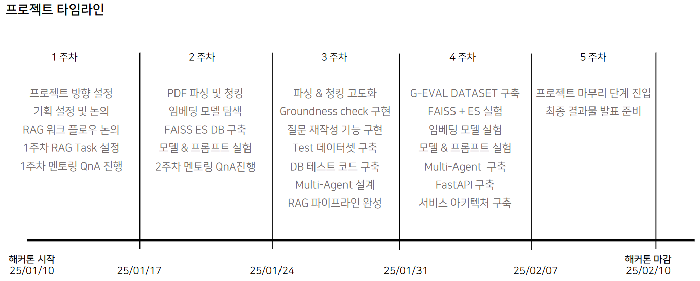
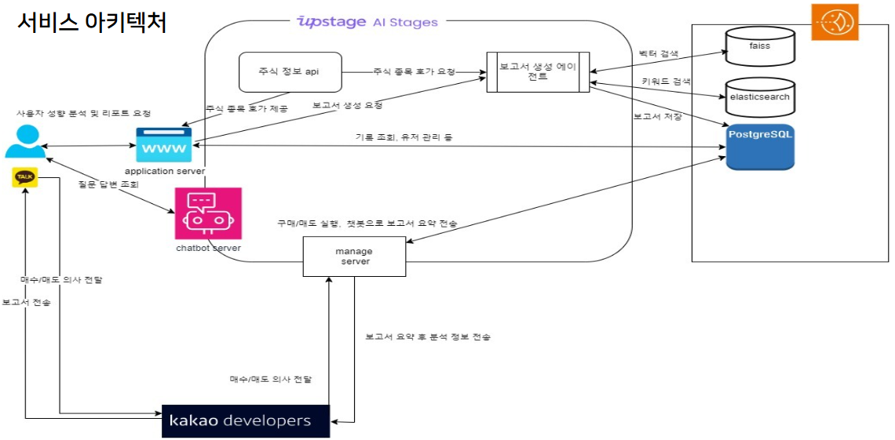
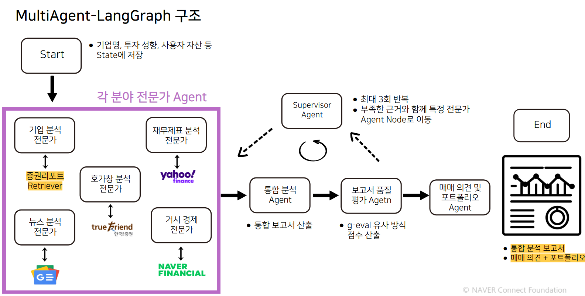

<div align='center'>

  # **NLP-13(NLP-CHEF) : AI Multi-Agent 기반 주식 매매 관리 서비스**

</div>

<div align='center'>


</div>

# **1. 프로젝트 개요**
## **1.1 프로젝트 소개**

### **기획 배경**
대부분 증권사 주식 리포트를 본다면 해당 기업의 매수/매도/목표가만 볼 것입니다. 그만큼 주식과 관련된 정보는 복잡하며 일반인은 빠르게 변하는 시장에 대응하기가 어렵습니다.<br>
이에 "거시경제/미시경제/차트/뉴스 등 각 분야에 특화된 AI 에이전트를 만들고 복잡한 의사결정을 대신해줄 수는 없을까?" 라는 아이디어를 가지고 프로젝트를 기획하게 되었습니다.

### **프로젝트 주제 및 주요 서비스**
<div align='center'>

<br>
투자하고 싶은 기업의 중요 정보를 쉽고 빠르게 **하루 3번**<br> **진행된 매매 포지션과 함께** 핵심 정보가 포함된 투자 리포트를 카톡알람 해주는 서비스를 제공합니다.
</div>


### **서비스의 3가지 핵심 기능**

✅ **AI 멀티 에이전트** 기반의 주식 매매관리 서비스<br>

✅ 각 분야에서 전문화 된 AI 에이전트가 **사용자의 투자성향을 고려하여 투자자에게 매매 포지션을 제공**<br> 

✅ RAG 시스템으로 출력되는 증권사 보고서의 정보와 웹 데이터(실시간뉴스/거시경제/미시경제/차트 등)를 고려한 **사용자 맞춤형 핵심 리포트를 제공**


## **1.2 NLP-CHEF 팀 소개 및 역할**

| 김현서 [](https://github.com/kimhyeonseo0830) | 이재룡 [](https://github.com/So1pi) | 이정인 [](https://github.com/unsolomon) | 이현풍 [](https://github.com/P-oong) | 임한택 [](https://github.com/LHANTAEK) | 최현우 [](https://github.com/pica-git0) |
|:---:|:---:|:---:|:---:|:---:|:---:|
|  |  |  |  |  |  |
| DB 설계<br>Reranking<br>Model & Prompt<br>Agent 설계 | DB 설계<br>Reranking<br>Model & Prompt | PDF 파싱<br>Embedding Test<br>Agent 설계 | PDF 파싱<br>Multi-Agent 설계<br>Reranking<br>Agent 설계 | 서비스 기획<br>PDF 파싱 및 청킹<br>RAG 고도화<br>Agent 구현<br>G-Eval Test<br>Model & Prompt | 서비스 기획<br>DB 설계<br>Embedding Test<br>정량 평가 API 배포<br>프론트엔드 개발<br>백엔드 개발 |

## **1.3 프로젝트 로드맵**



# **2. 시스템 아키텍처**

## 2.1 📁 **프로젝트 폴더 구조**

```sh
NLP-CHEF/
├── README.md                    # 프로젝트 메인 문서
├── agentserver/                 # Multi-agent 기반 보고서 생성 서버
│   ├── LangGraph.py             # 에이전트 파이프라인 메인 스크립트
│   ├── LangGraph_base.py        # LangGraph 기본 클래스 및 상태 관리
│   ├── app/                     # FastAPI 서버 애플리케이션
│   ├── daily_chart_utils/       # 차트 분석 유틸리티
│   ├── fin_*_agent.py           # 각종 전문가 에이전트 (재무, 뉴스, 거시경제 등)
│   ├── report_*.py              # 보고서 관련 에이전트 (통합, 감독 등)
│   ├── worker/                  # 작업 스케줄링 워커
│   └── run.sh                   # 서버 실행 스크립트
│
├── docs/                        # 문서 및 이미지 관리 폴더
│
├── embeddingserver/             # 텍스트 임베딩 생성 및 중개 서버
│   ├── app/                     # FastAPI 서버 애플리케이션
│   ├── output.py                # 출력 처리 모듈
│   └── requirements.txt         # 의존성 정의
│
├── manageserver/                # 주식 매매 관리 및 보고서 전송 서버
│   ├── app/                     # FastAPI 서버 애플리케이션
│   └── run.sh                   # 서버 실행 스크립트
│
├── notebooks/                   # 실험 및 프로토타입 개발
│   ├── RAG/                     # RAG 파이프라인 구축
│   └── app/                     # 앱 템플릿 프로토타입
│
└── webapplication/              # 웹 애플리케이션
    ├── backend/                 # FastAPI 백엔드 + Nginx 설정
    └── frontend/                # Streamlit 기반 프론트엔드

```

## **2.2 서비스 아키텍처**


## **2.3 RAG 아키텍처**


## **2.4 Multi-Agent 아키텍처**


# 3. Requirements
- Python 3.11.9

그 외의 요구 사항은 각 구성 요소마다 다릅니다.<br>요구 사항은 하위 폴더의 README.md에서 확인하실 수 있습니다.


# 4. Contributing
프로젝트에 기여하고 싶으시면 jilp1598.git@gmail.com 에 연락을 주세요.<br>
이슈를 발견하셨으면 [issue tracker](https://github.com/boostcampaitech7/level2-nlp-generationfornlp-nlp-13-lv3/issues/new)에 리포트해주세요.<br>

If you'd like to contribute to this project, please contact us at jilp1598.git@gmail.com.<br>  If you find any issues, please report them in the [issue tracker](https://github.com/boostcampaitech7/level2-nlp-generationfornlp-nlp-13-lv3/issues/new).<br>

# 5. Contact

기타 질문 및 토론 사항은 Github Discussion에 남겨주시면 됩니다.  

For any other questions or discussion topics, please leave them in the GitHub Discussion.


- **Github Discussion** : [Gihub Discussion](https://github.com/boostcampaitech7/level2-nlp-generationfornlp-nlp-13-lv3/discussions)


### Sponsors
<a href="https://boostcamp.connect.or.kr/program_ai.html"></a>

본 프로젝트는 네이버커넥트재단 부스트캠프 AI Tech 7기 기업 해커톤 프로젝트입니다.<br>
1달간 sprint 개발에 성실히 참여한 NLP-CHEF 팀 다시 한 번 수고 많으셨습니다.<br>
