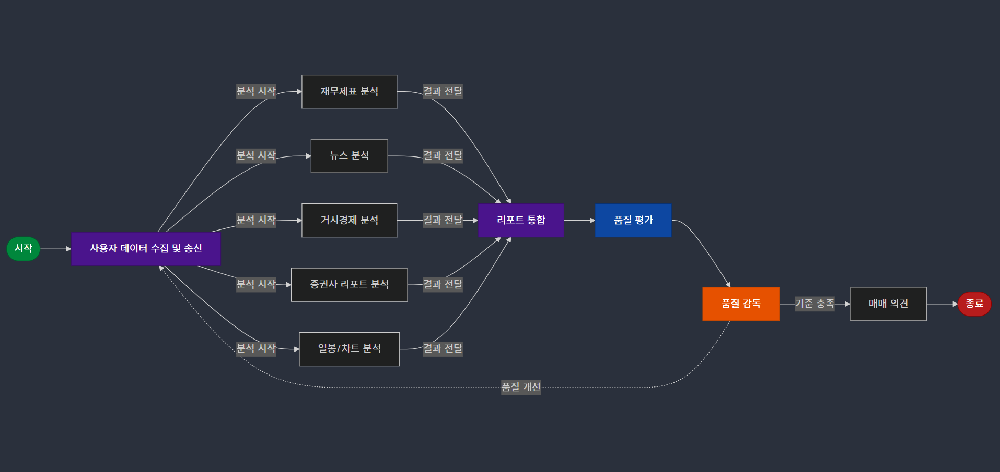

# Stock Analysis AI Agents System

## Overview
Multi-Agent 시스템을 활용하여 주식 투자 분석 및 매매 의견을 제공하는 종합 분석 시스템입니다. 다양한 전문 에이전트들이 각자의 전문 영역에서 데이터를 수집하고 분석해서 최종적으로 통합된 투자 결정을 제시합니다.

## System Architecture




1. 사용자 입력 (관심기업과 투자성향 선택)
2. 병렬 데이터 수집 및 분석 (각 전문가 에이전트)
3. 개별 리포트 생성
4. 통합 리포트 작성
5. 품질 평가
6. 필요시 리포트 개선
7. 최종 투자 의견 제시

---
### Core Integration Agent (1)

#### 전문가 의견 종합 전문가 (report_integration_agent)
- 사용 모델: o1-mini
- 주요 기능:
  - 하위 전문가들의 개별 분석 리포트 수집 및 통합
  - 상충되는 의견 조율 및 종합적 관점 제시
  - 최종 투자 리포트 생성
---
### Specialized Analysis Agents (5)

모든 하위 전문가는 GPT-4-mini 모델을 사용합니다.

#### 1. 재무제표 전문가 (fin_financial_statements_agent)
- 데이터 소스: yfinance
- 주요 기능:
  - 4개년 재무제표 데이터 수집
  - ROI 및 주요 재무비율 계산
  - 재무건전성 및 성장성 분석

#### 2. 거시경제 전문가 (fin_macro_index_agent)
- 분석 지표:
  - 환율 동향
  - 원자재 가격
  - 국채금리
  - 에너지/금속/농산물 시장 동향
- 한국 주식시장 영향도 분석 및 투자 방향성 제시

#### 3. 뉴스 전문가 (fin_news_analysis_agent)
- 실시간 뉴스 헤드라인 수집 및 분석
- 뉴스 감성 분석 및 트렌드 파악
- 기업 관련 주요 이슈 요약

#### 4. 일봉/차트 전문가 (fin_report_daily_chart_agent)
- 데이터 소스: 한국투자증권 mojito2 라이브러리
- 기술적 분석:
  - 일봉/월봉 차트 분석
  - 주요 기술적 지표 해석
  - 매매 시점 제안

#### 5. 증권사 레포트 전문가 (fin_reports_analysis_agent)
- RAG(Retrieval-Augmented Generation) 시스템 활용
- 증권사 분석 리포트 기반 심층 분석
- 전문가 의견 종합 및 해석

---

### Quality Control System (3)

#### 1. 레포트 품질 평가 전문가 (fin_report_scorer_agent)

- 평가 기준:
  - 임계점: 5점
  - 5점 이상: 매매 의견 단계로 진행
  - 5점 이하: 품질 개선 프로세스 진입

#### 2. 레포트 품질 판단 전문가 (report_supervisor_agent)

- 품질 개선 프로세스:
  - 각 하위 전문가 리포트 개별 평가
  - 최저 점수 전문가 리포트 재생성 요청
  - 최대 3회 반복 가능

#### 3. 매수/매도 의견 전문가 (final_analysis_agent)

- 투자 가능 금액 확인
- 투자 결정 제시:
  - 분할 매수/매도 전략
  - 보유 전략
  - 실행 가능한 구체적 매매 계획

## Technical Components

### Core System Files
- `LangGraph.py`: 
  - 전체 에이전트 시스템 통합 관리
  - 에이전트 간 통신 및 데이터 흐름 제어
  - 작업 순서 및 의존성 관리

- `LangGraph_base.py`:
  - 기본 상태 관리
  - DAG(Directed Acyclic Graph) 구조 정의
  - 에이전트 기본 클래스 및 인터페이스 정의

## Installation & Setup

### Prerequisites
```bash
# 의존성 설치
pip install -r requirements.txt
# or using Poetry
poetry install
```

### Execution
```bash
# 실행
./run.sh
```

## Dependencies
상세한 의존성 정보는 다음 파일들을 참조하세요:
- `pyproject.toml`
- `requirements.txt`
